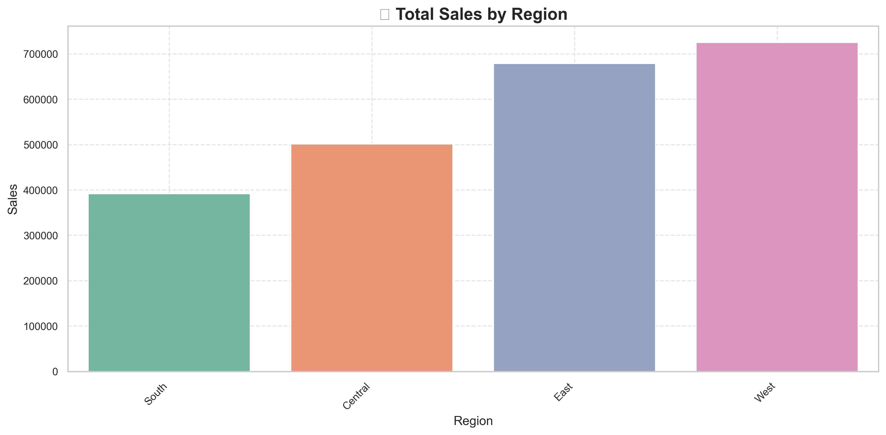
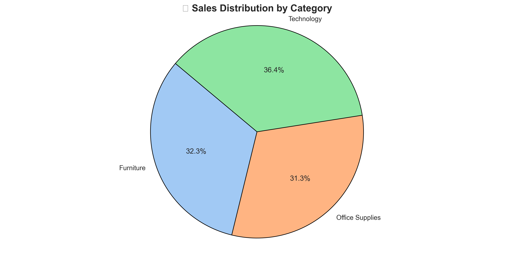
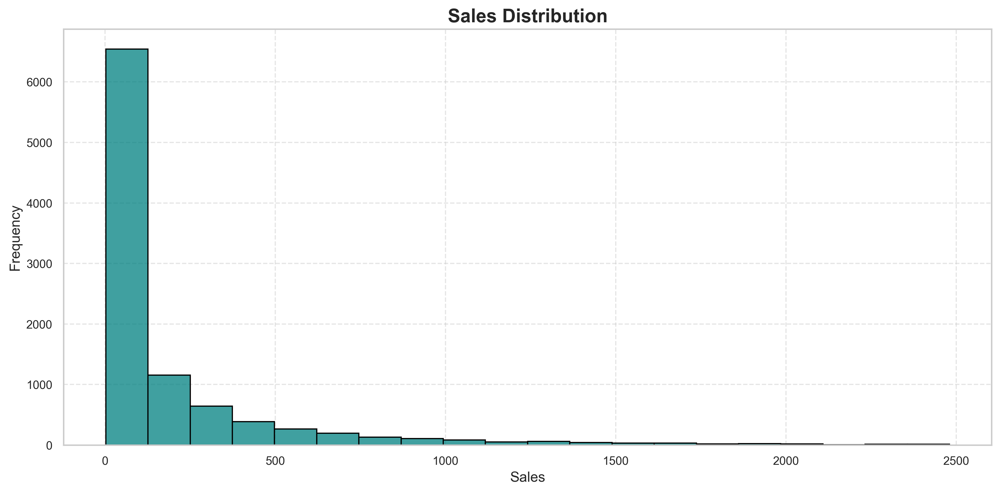
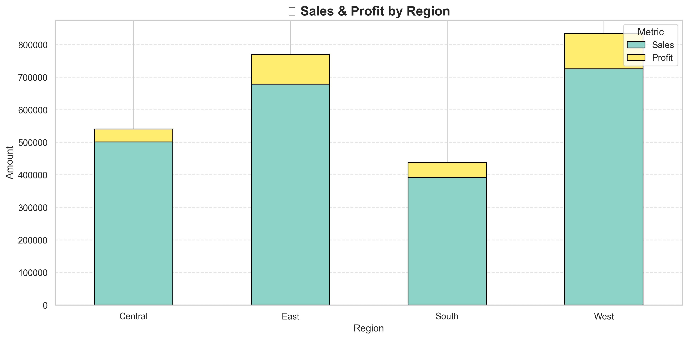

# 📊 Pandas Analyzer & Data Visualization

> 🔥 Developed by **Parth Shah** — Rising Student Developer | Data Thinker | Vision Architect  
> “Where code meets insight, and insight powers decisions.”

---

## 🌟 A Message from the Creator

Welcome to a next-generation analytics suite that redefines how we explore sales data.  
This isn’t just another Python project — it’s a **declaration of clarity, creativity, and confidence**. In this tool, you’ll find a fusion of:

- 📚 *Textbook theory* turned into working code  
- 🔍 *Real-world datasets* transformed into clean, insightful visuals  
- 💡 *Hands-on experience* made intuitive and interactive  

This project was built with purpose — to **empower students, businesses, and future analysts** to harness the full power of data. Let’s dive in. 🚀

---

## 📚 Table of Contents

- [🎯 Project Overview](#-project-overview)
- [🧪 Tech Stack](#-tech-stack)
- [⚙️ Features](#️-features)
- [🧠 Behind the Code](#-behind-the-code)
- [📊 Demo & Screenshots](#-demo--screenshots)
- [🚀 How It Works](#-how-it-works)
- [💬 FAQs](#-faqs)
- [📁 Project Structure](#-project-structure)
- [⚙️ Features & Functionalities](#️-features--functionalities)
- [⚙️ Installation & Setup](#️-installation--setup)
- [🖼 Image Upload Guide (For Mac + VS Code)](#-image-upload-guide-for-mac--vs-code)
- [✨ Highlights](#-highlights)
* [🌟 Final Words from THE PARTH SHAH](#-final-words-from-the-parth-shah)

---

## 🎯 Project Overview

**Objective:**  
Build a comprehensive **Sales Data Analyzer and Visualizer** using Python. This tool is designed to teach and demonstrate:

- 📈 Data manipulation with **Pandas**
- 🎨 Visual insights using **Matplotlib** and **Seaborn**
- 🧠 Analysis of sales, profit, and trends to drive business decisions

---

## 🧪 Tech Stack

| Technology     | Role                          | Badge |
|----------------|-------------------------------|-------|
| Python 🐍       | Core programming language      |  |
| Pandas 🐼       | Data manipulation              |  |
| NumPy 🔢        | Numerical array handling       |  |
| Matplotlib 📊   | Charting & plots               |  |
| Seaborn 🌊      | Statistical graphics & themes  |  |
| Jupyter 🧪      | Dev + Documentation environment|  |

---

## ⚙️ Features

- ✅ Load and explore real-world CSV sales data
- ✅ Clean missing data entries and handle errors
- ✅ Perform mathematical and statistical operations
- ✅ Sort, filter, and search through datasets interactively
- ✅ Generate pivot tables and grouped summaries
- ✅ Create stunning visualizations:
  - Bar, Line, Scatter, Pie, Histogram, Stack Plots
- ✅ Menu-based, beginner-friendly terminal UI
- ✅ Save visualizations as PNG files
- ✅ Fully Object-Oriented Design (OOP)

---

## 🧠 Behind the Code

At the heart of this project is the **`SalesDataAnalyzer`** class — a cleanly architected, modular design that encapsulates all logic:

```python
class SalesDataAnalyzer:
    def __init__(self):
        self.data = None
```

The tool is built to:
- Accept any **standard sales dataset**
- Walk the user through **exploration → cleaning → analysis → visualization**
- Provide an **interactive CLI** experience through a structured main `menu()`

With methods like `.search_sort_filter()`, `.statistical_analysis()`, and `.visualize_data()`, users get real-world, industry-grade exposure in a school-level project.

---

## 📊 Demo & Screenshots

> 💡 All screenshots are stored inside the `images` folder.

| Screenshot | Description |
|------------|-------------|
|  | 🏠 **Main Menu UI** |
|  | 📊 **Sales by Region (Bar Chart)** |
|  | 📈 **Sales Trend Over Time** |
|  | 🎯 **Sales vs Discount Scatter Plot** |
|  | 🧩 **Sales by Category (Pie Chart)** |
|  | 🪵 **Sales Distribution Histogram** |
|  | 📦 **Sales & Profit Stack Plot** |
|  | 💾 **Last Saved Visualization** |

---

## 🚀 How It Works

```text
▶ Step 1: Load your sales CSV file
▶ Step 2: Explore the data (head, info, describe)
▶ Step 3: Clean missing values
▶ Step 4: Perform mathematical/statistical analysis
▶ Step 5: Search, sort, and filter data as needed
▶ Step 6: Generate visualizations
▶ Step 7: Save any chart as a high-quality image
```

The program runs via `menu()` and guides you through all features using simple numbered options.

---

## 💬 FAQs

<details>
<summary>📂 Where should I place my dataset?</summary>
Place your CSV file (e.g., `Superstore.csv`) in the project root or a `data` folder. Then provide the path when prompted in the program.
</details>

<details>
<summary>🖼 Why is my image not saving?</summary>
Ensure you're viewing a chart before saving. The function `save_visualization()` saves only the last chart displayed via `self.last_fig`.
</details>

<details>
<summary>🔍 What if I want to filter by multiple columns?</summary>
Currently, filtering is handled by grouping and aggregation via one column. You can extend it in `.search_sort_filter()` to accept multiple conditions.
</details>

---

## 📁 Project Structure

```
Pandas-Analyzer-Project/
│
├── images/
│   ├── Demo_1.png
│   ├── BarPlot.png
│   ├── LinePlot.png
│   ├── ScatterPlot.png
│   ├── PieChart.png
│   ├── HistogramPlot.png
│   ├── StackPlot.png
│   └── LastChart.png
│
├── Superstore.csv
├── .gitignore
├── Visualizer.py
├── requirements.txt
└── README.md
```

---

---

## ⚙️ Features & Functionalities

### 🛠️ Core Functionalities

- ✅ **Load & Validate Sales CSV Data**
  - Accept retail sales CSV file from user input
  - Handle file not found or format issues gracefully
- 🧼 **Data Cleaning & Preparation**
  - Check for missing/null values
  - Remove rows with critical missing entries
  - Clean incorrect data formats (e.g., dates)
- 📊 **Mathematical Operations**
  - 🔢 Total Sales, Average Profit
  - 📌 Highest Sales Product & Region
- 📂 **Data Filtering Options**
  - By Region
  - By Customer Name
  - By Category or Product
- 🧮 **Statistical Computations**
  - Standard Deviation, Variance, Percentiles
  - Quantile-based distribution check
- 🧾 **Aggregations**
  - Group by Region/Product
  - Sum, Mean, Count, Min, Max
- 🔍 **Search, Sort & Filter Menu**
  - Keyword-based search on any column
  - Sort ascending/descending on selected field
  - Aggregated filter view by group and column
- 🔗 **Pivot Table Generator**
  - Sales by Region & Category cross-tab
  - Summarize data with `pd.pivot_table()`

### 📉 NumPy-Driven Functionalities

- 🔢 Convert DataFrame columns to NumPy arrays
- ➗ Perform array slicing, indexing
- ➕ Element-wise operations (e.g., sales growth)
- 📈 Calculate statistics: mean, std, var, quantile

### 📈 Visualization Suite

- 📊 **Bar Plot:** Sales by Region
- 📈 **Line Plot:** Daily Sales Trends
- 🎯 **Scatter Plot:** Profit vs Sales or Custom X/Y
- 🧩 **Pie Chart:** Sales by Category
- 📉 **Histogram:** Sales Distribution
- 📦 **Stack Plot:** Sales & Profit stacked by Region
- 🔁 Loop-based plotting with Matplotlib & Seaborn
- 💾 Save charts in `.png` format (300 DPI)

### 🧠 Architecture Highlights

- ✅ **Object-Oriented Design**
  - All logic wrapped inside `SalesDataAnalyzer` class
  - Constructor/Destructor used effectively
- 🧭 **Menu-Driven UI**
  - Console interface for all features
  - Clean exit, interactive choices
- 🛡️ **Error Handling**
  - Try/except for file handling & plotting
  - Checks for empty/invalid input
- 🔄 **Reusable & Extensible**
  - Designed for academic, business, or internship demos

---

## ⚙️ Installation & Setup

### Step 1: 📦 Install Dependencies
```bash
pip install pandas matplotlib seaborn
```

### Step 2: ▶️ Run the Program
```bash
python Visualizer.py
```

### Step 3: 🧪 For Jupyter Users
```bash
jupyter notebook
```

---

## 🖼 Image Upload Guide (For Mac + VS Code)

1. **Create a folder** named `images` in your project root.
2. **Add your PNG/JPG screenshots** to that folder.
3. **Embed screenshots in Markdown** using:
```markdown

```
4. ✅ Follow naming conventions like:
   - `Demo_1.png`, `BarPlot.png`, `StackPlot.png`, etc.

---

## ✨ Highlights

- 📂 **Data-centric class architecture** using OOP
- 🧠 **Student-friendly logic** that’s practical yet professional
- 🎨 **Polished visuals** with themes, labels, and formatting
- 💾 **Chart export** functionality for presentations
- 🧪 **Error handling** and input validation
- 🔁 **Reusable & extendable codebase**
- 🧙‍♂️ **Parth’s Signature Touch**: Clear, creative, and committed to excellence

---

---

## 🌟 Final Words from THE PARTH SHAH

This project is **more than just homework** — it’s a reflection of what’s possible when **discipline meets design**, and **logic meets imagination**.

> *"I don’t just write code — I create tools that help others see patterns in chaos, insights in data, and decisions in numbers."*

If this project inspired you or helped you understand data science better, please:

⭐ **Star this repository**
🔁 **Fork it and build on it**
📬 **Let’s connect on [LinkedIn](https://www.linkedin.com/in/parth-shah-28387532b/?utm_source=share&utm_campaign=share_via&utm_content=profile&utm_medium=ios_app)**

**— THE PARTH SHAH**
> 🧠 Passionate Learner | 🧑‍💻 Python Evangelist | 🚀 Future Clinical Psychologist meets Data Visionary
Together, let’s shape the future of data-driven thinking 🚀

---

Made with 💙 by **THE PARTH SHAH**

